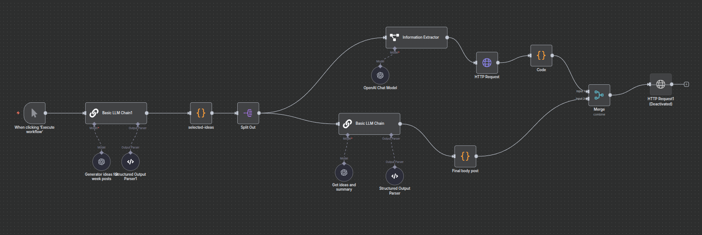
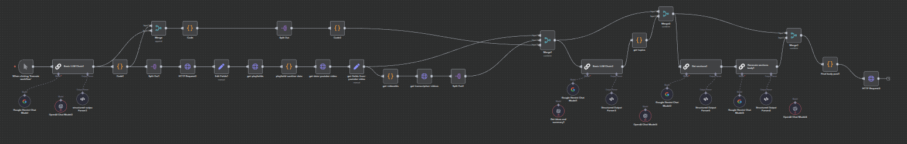

# PIXEL SANS

A modern full-stack application for a gaming website featuring a NestJS backend API with video transcription capabilities and a vanilla JavaScript frontend with modular architecture.

## 🏗️ Project Architecture

This project is structured as a monorepo with two main components:

- **Backend**: NestJS API server with MongoDB, video transcription, and AI content generation
- **Frontend**: Modern vanilla JavaScript application with modular architecture

## 🚀 Features

### Backend Features
- **NestJS Framework**: Modern TypeScript server-side framework
- **Video Transcription**: YouTube video processing and transcription capabilities
- **AI Content Generation**: OpenAI integration for automated content creation
- **MongoDB Integration**: Document-based database with Mongoose ODM
- **Post Management**: Full CRUD operations for blog posts
- **N8N Workflows**: Automated content generation workflows
- **Docker Support**: Containerized deployment with Docker Compose
- **Global Exception Handling**: Centralized error management
- **Validation Pipes**: Automatic request validation

### Frontend Features
- **Modular ES6+ JavaScript**: Clean separation of concerns with dedicated modules
- **Modern CSS Architecture**: Component-based styling with CSS custom properties
- **Responsive Design**: Mobile-first approach with fluid layouts
- **Accessibility First**: WCAG 2.1 AA compliant
- **Dark/Light Theme**: Automatic system preference detection
- **Progressive Enhancement**: Works without JavaScript, enhanced with it
- **Performance Optimized**: Lazy loading and efficient DOM manipulation

## 📁 Project Structure

```
pixel-sans/
├── backend/                  # NestJS API Server
│   ├── src/
│   │   ├── app.module.ts    # Main application module
│   │   ├── main.ts          # Application entry point
│   │   ├── common/          # Shared utilities and DTOs
│   │   │   ├── dto/         # Data transfer objects
│   │   │   ├── filters/     # Exception filters
│   │   │   ├── helpers/     # Utility helpers
│   │   │   └── interceptors/ # Response interceptors
│   │   ├── config/          # Configuration files
│   │   ├── database/        # Database module and configuration
│   │   ├── post/            # Post management module
│   │   │   ├── dto/         # Post-related DTOs
│   │   │   ├── entities/    # Post entity definitions
│   │   │   └── schema/      # Database schemas
│   │   └── transcription-videos/ # Video transcription module
│   ├── n8n/                # N8N automation workflows
│   │   └── workflows/       # Workflow definitions
│   ├── docker-compose.yml   # Docker services configuration
│   ├── Dockerfile          # Container build instructions
│   └── package.json        # Dependencies and scripts
├── frontend/               # Vanilla JavaScript Frontend
│   ├── assets/
│   │   └── css/           # Modular CSS architecture
│   │       ├── main.css   # CSS entry point
│   │       ├── base.css   # Variables and resets
│   │       ├── components.css # Component styles
│   │       └── utilities.css  # Utility classes
│   ├── js/
│   │   ├── modules/       # Feature modules
│   │   │   ├── theme.js   # Theme management
│   │   │   ├── navigation.js # Navigation logic
│   │   │   ├── notifications.js # Toast notifications
│   │   │   ├── search.js  # Search functionality
│   │   │   ├── robux.js   # Game-specific features
│   │   │   ├── scroll-effects.js # Scroll animations
│   │   │   └── accessibility.js # A11y enhancements
│   │   ├── api/           # API integration
│   │   │   ├── api-client.js # HTTP client
│   │   │   ├── endpoints.js  # API endpoints
│   │   │   └── pagination.js # Pagination logic
│   │   ├── utils/         # Utility functions
│   │   ├── config/        # Configuration
│   │   └── main.js        # Application entry point
│   ├── *.html            # HTML pages
│   └── README.md         # Frontend documentation
└── README.md             # This file
```

## 🛠️ Backend Technology Stack

- **Framework**: NestJS (Node.js framework)
- **Language**: TypeScript
- **Database**: MongoDB with Mongoose ODM
- **Video Processing**: youtube-dl, yt-dlp, FFmpeg
- **AI Integration**: OpenAI API
- **Automation**: N8N workflows
- **Containerization**: Docker & Docker Compose
- **Validation**: class-validator, class-transformer

### Backend API Endpoints

- `POST /post` - Create new post
- `GET /post` - Get paginated posts
- `GET /post/:id` - Get post by ID
- `PUT /post/:id` - Update post
- `DELETE /post/:id` - Delete post
- `POST /transcription-videos/transcribe` - Transcribe video
- `POST /transcription-videos/video-to-post` - Convert video to post

## 🎨 Frontend Technology Stack

- **Language**: Vanilla JavaScript (ES6+)
- **Styling**: CSS3 with Custom Properties
- **Architecture**: Modular ES6 modules
- **Build**: No build process required
- **Responsive**: CSS Grid & Flexbox
- **Accessibility**: WCAG 2.1 AA compliant

## 🚀 Getting Started

### Backend Setup

1. **Clone the repository**
   ```bash
   git clone <repository-url>
   cd pixel-sans/backend
   ```

2. **Install dependencies**
   ```bash
   npm install
   ```

3. **Environment setup**
   ```bash
   cp .env.example .env
   # Edit .env with your configuration
   ```

4. **Run with Docker (Recommended)**
   ```bash
   docker-compose up -d
   ```

5. **Or run locally**
   ```bash
   npm run start:dev
   ```

The backend will be available at `http://localhost:8080`
N8N automation interface will be available at `http://localhost:5678`

### Frontend Setup

1. **Navigate to frontend directory**
   ```bash
   cd pixel-sans/frontend
   ```

2. **Serve with any static server**
   ```bash
   # Using Python
   python3 -m http.server 3000
   
   # Using Node.js serve
   npx serve .
   
   # Using Live Server (VS Code extension)
   # Just open index.html with Live Server
   ```

3. **Configure API Base URL**
   
   Update the frontend configuration to match your backend URL:
   ```javascript
   // Edit frontend/js/config/constants.js
   export const APP_CONFIG = {
       API: {
           BASE_URL: 'http://localhost:8080', // Change if needed
           // ...
       }
   };
   ```
   
   **Important**: If you're running the backend on a different port or host, update the `BASE_URL` accordingly:
   - **Docker**: Usually `http://localhost:8080` (default)
   - **Local npm**: `http://localhost:8080` or your configured PORT
   - **Production**: Update to your production domain

4. **Open in browser**
   ```
   http://localhost:3000
   ```

## 🤖 N8N Automation Workflows

This project leverages N8N for automated content generation with AI-powered workflows:

### Available Workflows

1. **Generate Post Clickbait** (`Generate post clickbite.json`)
   - Creates engaging titles and descriptions for posts
   - Uses AI to generate click-worthy headlines
   - Optimizes content for social media engagement

   

2. **Generator Post Blog from Source** (`Generator post blog from a source.json`)
   - Converts video content into blog posts
   - Transcribes YouTube videos automatically
   - Generates SEO-optimized blog content using OpenAI
   - Creates structured posts with proper formatting

   

### Workflow Features

- **YouTube Integration**: Automatic video downloading and processing
- **AI Content Generation**: OpenAI-powered content creation and optimization
- **Automated Publishing**: Direct integration with the backend API
- **Content Categorization**: Automatic tagging based on gaming categories (Roblox, Free Fire, Valorant, etc.)
- **SEO Optimization**: Generated content includes meta descriptions, keywords, and structured data

### N8N Setup

The N8N instance is automatically configured with Docker Compose and includes:
- **Basic Authentication**: Secured access with username/password
- **API Integration**: Connected to the main backend API
- **YouTube API**: For video metadata and processing
- **OpenAI Integration**: For content generation and enhancement
- **Timezone Configuration**: Set to America/Bogota

Access N8N at `http://localhost:5678` with your configured credentials.

## 🔧 Development

### Backend Development

- **Development mode**: `npm run start:dev`
- **Production build**: `npm run build`
- **Production start**: `npm run start:prod`

### Frontend Development

The frontend uses vanilla JavaScript modules, so no build process is required. Simply edit files and refresh the browser. For optimal development experience:

1. Use a local server (not file:// protocol)
2. Enable browser dev tools
3. Use the browser's module debugger

## 🌐 Environment Variables

### Backend Required Variables

```bash
# Database Configuration
DATABASE_URL=mongodb://localhost:27017/pixelsans

# Server Configuration
PORT=8080
ENV=development

# AI Integration
OPENAI_API_KEY=your_openai_api_key

# YouTube Integration
YOUTUBE_API_KEY=your_youtube_api_key

# API Configuration
API_URL=http://localhost:8080

# N8N Automation Configuration
N8N_BASIC_AUTH_USER=admin
N8N_BASIC_AUTH_PASSWORD=password
```

### Frontend Configuration

The frontend API configuration is located in `frontend/js/config/constants.js`:

```javascript
export const APP_CONFIG = {
    API: {
        BASE_URL: 'http://localhost:8080', // Update this if backend runs on different port/host
        // ...
    }
};
```

**Important**: Always ensure the frontend `BASE_URL` matches your backend configuration:
- If backend runs on port 3000: change to `http://localhost:3000`
- If using custom domain: change to your domain URL
- If deploying separately: update to your backend's public URL

## 📝 API Documentation

The backend provides a RESTful API with the following main features:

### Core API Endpoints

- **Post Management**: CRUD operations for blog posts
- **Video Transcription**: YouTube video processing and content extraction
- **Automated Content Generation**: AI-powered post creation from video sources
- **Pagination**: Efficient data retrieval with pagination support

### Automated Content Pipeline

The project includes automated workflows powered by N8N that:

1. **Monitor YouTube sources** for new gaming content
2. **Extract and transcribe** video content using AI
3. **Generate blog posts** with SEO optimization
4. **Create engaging titles** and meta descriptions
5. **Categorize content** automatically (Roblox, Free Fire, Valorant, Brawl Stars, etc.)
6. **Publish directly** to the backend API

This automation enables hands-free content generation, allowing the system to continuously create fresh gaming content without manual intervention.

## 🤝 Contributing

1. Fork the repository
2. Create a feature branch: `git checkout -b feature-name`
3. Commit changes: `git commit -am 'Add feature'`
4. Push to branch: `git push origin feature-name`
5. Submit a pull request

## 📄 License

This project is licensed under the UNLICENSED license.

---

## 🤝 Author

**Nelson Gallego**  
[GitHub](https://github.com/nelsin-06)  
[LinkedIn](https://www.linkedin.com/in/nelson-gallego-tec-dev)

---
